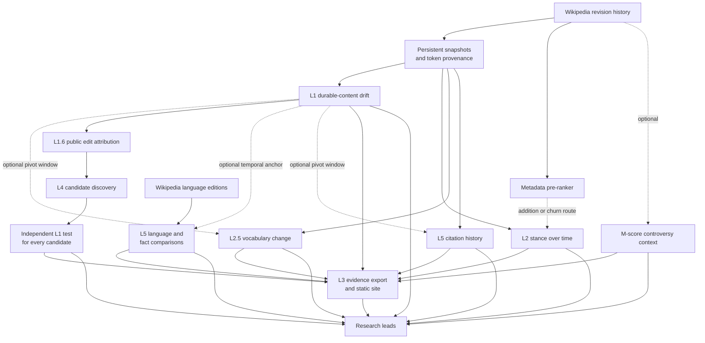

# How it works

WikiDrift reads an article's public history in layers. Each layer answers a different question, and
the result is evidence to inspect rather than a single bias score.
{: .summary}

The method separates four questions that are easy to blur together:

- **Change detection:** Was a substantial amount of established content replaced?
- **Change interpretation:** Did the wording or stance move in a particular direction?
- **External comparison:** Does the article differ from other language editions or from its own
  citation history?
- **Discovery:** Once a change has been found, which other articles are worth testing?

Editor activity, controversy, and disagreement between languages add context. They do not tell us by
themselves why a change happened or which version is correct.

## Two kinds of article history

The tool has to handle two very different cases.

1. **The story changed later.** Wording that had remained for years was removed or replaced, and the
   replacement lasted. The article's own history may reveal that change.
2. **The story was framed that way from the beginning.** There is no earlier baseline to recover.
   Historical change detection may show nothing, so the useful comparisons are outside the English
   article: other language editions, factual claims, and sources.

The core detector is built for the first case. Cross-language, fact, and source checks provide partial
coverage of the second. A stable article is not necessarily neutral, and a heavily rewritten article
is not necessarily wrong.

## The tool at a glance

The default `pipeline` command runs L1, the metadata pre-ranker, and L2.5. It does not run every box in
the diagram. L2 runs only when the pre-ranker produces an addition or churn lead and the user enables
the language-model option. M-score and the cross-language lead comparison also require explicit options.
L1 supplies a temporal anchor to L2.5 and cross-language comparison when it has a usable candidate or
confirmed window; those checks can still use whole-history or static comparisons without one. L3 turns
saved findings into readable before-and-after and authorship views for the published site. L4 discovery
and the fuller language, fact, and source checks are separate commands. This is why one published article
may have more tabs or evidence than another.

## Preparing an article history

The analysis starts with a local corpus built from public Wikipedia revision data. It stores revision
metadata, selected versions of each article, and token provenance: which revision introduced each
token and, where available, which revisions removed it.

For each sampling date, WikiDrift looks within 21 days and prefers the nearest revision whose byte size
is within 25% of the local median. This rejects many short-lived blankings and vandalism-and-revert
cycles. If none of the revisions in that window meet the size rule, it uses the nearest one. If the
window is empty, it uses the latest revision before the sampling date. The selected versions become
**snapshots**.

For every snapshot, the corpus records which provenance-tracked tokens are present. Later checks can
then distinguish established wording from newly added text and connect a lasting removal to the
revision in which it occurred.

This is why the core measurement is not an edit count or a raw byte difference. It asks how much text
with a demonstrated history of survival was lost.

## The metadata pre-ranker: deciding what to inspect

The pre-ranker is a fast routing step. It reads timestamps, article sizes, and editors, but not the
prose itself.

It smooths the revision-size history to suppress isolated blank-and-restore events, groups activity
into time windows, and compares additions and removals with the article's usual activity. It can
produce three kinds of lead:

- **Removal:** an unusually large deletion should go to the token-level L1 detector.
- **Addition:** substantial growth may have changed the framing without removing much text, so it is
  better examined with stance analysis.
- **Churn:** a medium-sized removal that is unusually large relative to the article's own removal
  baseline may indicate replacement that the absolute removal threshold misses, so it is routed to
  a semantic check.

This is a broad filter on purpose. It points the more expensive checks toward useful windows; it does
not decide what happened.

## L1: detecting durable rewrites

L1 is the main offline change detector. It compares every covered pair of consecutive snapshots and
measures established text lost, standing text gained, and text retained.

Each token is weighted by the number of snapshots it had survived up to that point. The calculation
for one interval is:

`D_k = sum(weight of each lost token) / sum(weight of each token present before the interval)`

In plain terms: removing wording that had survived across many snapshots counts more than removing
wording that had just appeared. New text is measured at the interval end, so additions must still be
standing there to count. Concurrent loss and standing gain produce a replacement lead, not a claim that
one passage semantically replaced another.

### Finding candidate episodes

The recall sweep preserves every covered interval with at least 15% loss, 15% standing gain, or 10%
paired change. It uses absolute PWR mass to set review priority, never to hide a lead. A dramatic
percentage can receive high priority even in a small article.

Exact durable-spine checking begins at 1,000 starting tokens. This floor is structural: confirmation
uses the top persistence half and requires a 500-token cohort. Below 1,000 tokens an anomaly remains
visible as descriptive evidence, but the system does not pretend it can confirm an exact collapse.

For loss confirmation, an interval with at least 15% persistence-weighted loss can start or extend an
episode, and an episode needs a peak of at least 25% to become a pivot candidate.

Candidate detection has two passes:

1. The primary pass checks every sharp interval episode above and sends every confirmable candidate to
  revision-level confirmation.
2. If none confirms, a rolling second pass measures the direct persistence-weighted loss of the same
  starting cohort across approximately twelve months. It requires at least 20% loss. Overlapping windows are reduced to the strongest
  non-overlapping candidates before confirmation.

The rolling pass is a candidate search, not a second definition of a pivot. It improves recall for
sustained medium-sized replacement without lowering the primary 25% threshold. Candidates from both
passes face the same revision-level test below.

The rolling candidate thresholds are preliminary. They recovered a confirmed case that the primary
interval threshold missed, but the existing offline benchmark does not yet score this fallback end to
end. A fixed slate of positive and control articles is still needed to measure its recall and false-
candidate load. Until then, the unchanged revision-level confirmation is the main precision safeguard.

The initial outcomes are:

- **PIVOT?** A large candidate episode exists, but the revision-level check has not confirmed it.
- **CREEP?** No single episode clears the pivot rules, but mean interval loss is elevated.
- **DESCRIPTIVE ANOMALY.** The sweep crossed a loss, gain, or paired-change threshold but exact
  confirmation is unavailable or not applicable.
- **HEALTHY.** No sweep anomaly exists and mean interval loss is below the creep threshold.
- **SKIP.** There are too few snapshots for the measurement.

These labels describe the detector's result, not the quality or neutrality of the article. An old
rewrite is not discounted simply because it is old; its age is reported as context.

### Confirming the collapse

For a full analysis, WikiDrift checks up to three primary candidates. If none confirms, it checks up
to three non-overlapping rolling candidates. For each candidate, it takes the more persistent half of
the text present at the start and searches the underlying revisions for the pair where survival of
that text drops most sharply.

WikiDrift calls that more persistent starting half the **durable spine**. The **durable-spine drop**
is the percentage-point decline in how much of that cohort survives from the beginning to the end of
the whole candidate window. The exact before-and-after revision pair localizes the dominant step
inside the window; the reported percentage remains the whole-window decline. It measures established
wording loss, not whether the resulting text is better, worse, more neutral, or less neutral.

The durable text must decline by at least 20 percentage points across the interval to confirm the
pivot. This keeps a coarse snapshot gap from looking decisive when the revisions inside it do not
show the same collapse. The confirmation artifact keeps an audit receipt for every candidate sent to
this exact check: its source pass, coarse dates and revisions, PWR mass, peak loss, exact revision pair
and measured durable-spine drop when resolvable, plus the decision. Rejections state either that the
drop was below the required threshold or that there was insufficient revision evidence to resolve an
exact pair. Candidates not sent to exact checking are not represented as rejected. Findings also record
whether a confirmed candidate came from the primary interval pass or the rolling pass.

### Attributing public edits

For a confirmed episode, L1 resolves the ordered revisions between the stable before and after states.
It reports two kinds of accounting:

- **Gross activity:** every observed addition, removal, and restoration in the bounded sequence.
- **Net-standing contribution:** removals still absent at the after state and replacement wording that
  survives there. Reverted intermediate work remains visible in gross activity but not standing shares.

Per-revision rows reproduce every displayed share. Hidden names, anonymous IPs, bots, renamed accounts,
and unavailable account states remain distinct without identity inference. The full analysis attributes
up to the two largest confirmed episodes. It reports public editing actions, not motive, off-wiki identity,
or coordination. Concentration labels remain disabled pending control-set calibration.

### Editorial-process context

An opt-in receipt can add bounded edit summaries, tags, restoration relationships, talk-page activity,
protection state, page operations, and selected dispute templates. Displayed items link to exact public
revisions or logs and preserve `observed`, `not_observed`, and `unavailable` states. This context can identify
alternatives worth inspecting, but it cannot change confirmation or corroboration and does not establish
motive, coordination, bias, or misconduct.

### What L1 can and cannot say

L1 detects durable replacement. It does not determine whether the replacement was more accurate,
better sourced, more neutral, or worse. A legitimate reorganization can produce a large pivot. A
consistently slanted article can produce no pivot at all. The other layers exist because structural
change and editorial judgment are different questions.

## L2: comparing stance over time

L2 is an optional language-model check. It takes prose from stored snapshots, extracts passages that
mention a focal entity, and classifies how each passage treats that entity:

- critical;
- neutral;
- sympathetic;
- absent.

If the user does not name an entity, L2 uses the article title. Every classification retains the exact
passage, revision link, passage hash, prompt and model contract, confidence, evidence spans, and raw run.
When initial labels differ across adjacent observations, L2 repeats both classifications. It reports an
audited shift only when the passage text changed, repeated runs meet the agreement and evidence-coverage
floors, and the prompt/model contracts are compatible. Otherwise it identifies model instability, combined
text and model change, or insufficient evidence. The user can narrow the range with a start date.

This check is useful when the article grew or churned without a large net deletion. It can also help
separate a structural overhaul with broadly stable stance from one accompanied by a semantic shift.

Because L2 uses a language model, its output is inspectable evidence rather than a final label. It is
a temporal comparison, so it may also miss framing that was stable from the article's beginning.

## L2a: tracing additive and formative framing

The deterministic framing trajectory compares exact revisions selected from integrity-usable snapshots
through the stable endpoint. It classifies sentence-level units as added, removed, retained, or relocated;
separates lead and body weight; records section changes and parseable citation-domain changes; and marks
additions as standing or transient across later selected revisions. Formative, interval, and explicit
exact-event modes are available. These receipts are framing-change research leads only: additions do not
independently establish bias, factual error, intent, or misconduct and do not increase corroboration counts.

## L2.5: showing which vocabulary changed

L2.5 is an offline vocabulary comparison. When L1 finds a pivot, it compares snapshots immediately
before and after the episode. Otherwise, it compares the oldest and newest usable snapshots.

After lowercasing, tokenizing, and removing common stop words, it calculates:

- **Jensen-Shannon divergence:** an overall measure of how different the two word distributions are;
- **smoothed log-odds:** terms that are unusually common after the change and terms that were more
  common before it.

This gives the rewrite a readable vocabulary signature. It shows what changed in emphasis or topic,
but it does not assign an ideology, sentiment, or neutrality score to those words.

## M-score: measuring edit conflict

The optional M-score examines reverts rather than prose. Matching revision hashes reveal when one
editor restored an earlier version. The refined score keeps registered, non-bot editor pairs with at
least two reverts in each direction.

A high score means the page saw sustained mutual reverts. It does not mean a rewrite was malicious.
A low score does not clear an article either: it may indicate that a large change happened without an
edit war. M-score is context for a content finding, not a content finding itself.

## L3: showing the evidence on the website

L3 is the presentation layer. Analysis commands write structured findings; L3 turns those findings into
artifacts the static site can render so a reader can inspect the wording, not only the summary metrics.

It does three related jobs:

1. **Rewrite redlines.** For each L1 candidate that reached revision-level investigation, L3 materializes
   the public before and after revisions as readable prose. Removed wording is marked as deleted text and
   replacement wording as inserted text. Confirmed and rejected investigations both keep a redline when
   the revision pair can be retrieved; the outcome label stays attached so a rejected candidate is never
   presented as a confirmed rewrite.
2. **Authorship overlay.** Where token provenance is available, L3 attributes spans of the current lead to
   the public account and origin revision that introduced them. Adjacent tokens with the same origin may
   be grouped into readable spans. Unknown provenance stays visibly unknown. This records observable
   origin, not identity, motive, coordination, or factual correctness.
3. **Publication trust gates.** Stale confirmation artifacts, quarantined revisions, or pairs that cannot
   be materialized are withheld with a reason rather than published as current evidence. A missing L3
   artifact means the presentation data is unavailable; it is not a negative finding about the article.

L3 does not re-run L1, stance, vocabulary, discovery, or cross-language checks. It reads the local corpus
and public Wikipedia and WikiWho services to assemble diffs and authorship views from already-saved
results. The site builder is a further read-only step: it consumes the findings and L3 artifacts and
emits static HTML under `docs/`. That compiled site is what readers browse; the command-line tool remains
the analysis engine.

Fallback comparisons (for example when no fresh confirmed pivot exists) still identify how the compared
versions were chosen. They are not labeled as exact confirmed events. Every published redline remains
evidence of change to inspect, not a verdict that the earlier wording was better or that anyone acted in
bad faith.

## L4: using a finding to discover other candidates

L4 uses fresh structured attribution from an exact confirmed L1 event as a starting point for finding
other articles worth testing. It does not extend the seed article's result to other pages.

The process is:

1. Take leading named, non-bot accounts associated with removals in the seed article's exact confirmed
  event. Anonymous IPs and hidden names do not become graph nodes.
2. Examine their recent public contributions to other main-namespace articles.
3. Keep articles where those accounts made substantial aggregate deletions.
4. Rank candidates by shared accounts and bytes removed.
5. Build each candidate's own history and run full independent L1 confirmation.

Editor overlap chooses where to look. It does not decide the result. L4 promotes a candidate to a
retrofit lead only when that article's own history reaches exact confirmation and shows at least two
years of prior history. A coarse candidate is not sufficient. L4 retains rejected and unavailable
retest results as negative or insufficient evidence.
A large change earlier in a young article is treated as a framing question rather than a retrofit.

## L5: comparisons outside the English article's timeline

Internal history cannot answer every question. L5 is a family of checks that compare language
editions, factual claims, citations, and the article's own sourcing trajectory.

### Cross-language lead comparison

The cross-language lead comparison compares lead sections from English and a selected group of other
language editions. It asks a language model to identify substantive differences, contradictions, or
omissions.

English is always the anchor. A cached, model-assisted topic category first adds a small comparison
slate: Arabic and Hebrew for Israeli–Palestinian topics, Polish and German for Polish World War II
topics, and no preset editions for general topics. The tool then adds up to two more non-English
editions with the largest current articles by byte length. These additions do not replace the category
slate. Editions below 2,000 bytes are treated as stubs, duplicates are removed, and the final candidate
set is capped at five editions including English.

In a temporal comparison, an edition reaches the final result only when WikiDrift can retrieve both a
usable "before" lead and a usable "after" lead around the English timestamps. An edition missing either
side is dropped. The current implementation does not backfill another language after that point, so the
published comparison can contain fewer than five editions even when the initial candidate set was full.

The lead comparison first looks for a fresh L1 confirmation artifact. If one exists, English uses the exact
revision pair where the durable text collapsed. Every other edition uses the last revision at or
before the confirmed English "before" timestamp and the first revision at or after its "after"
timestamp. This mode is labeled **pivot-relative**.

The confirmation artifact records the corpus horizon and L1 thresholds used to create it. If either
has changed, the lead comparison ignores the artifact rather than silently reusing stale evidence. It then
falls back to the top coarse L1 candidate and labels the result **candidate-relative**. If L1 has no
candidate window, it compares current leads in **static** mode. The `--static` option requests that
mode explicitly.

All temporal modes keep revision IDs, timestamps, lead text, supporting quotations, and links to the
exact Wikipedia versions. To keep structured responses complete and reviewable, the lead comparison retains
at most the six strongest non-duplicative divergences and bounds the length of descriptions and direct
quotations. This is a ranked research lead, not an exhaustive catalog of every wording difference.

Different editions have different communities, source pools, scopes, and update schedules. A
cross-language difference shows divergent framing; it does not decide which edition is right.

### Facts and citation domains across editions

For articles with researcher-configured factual questions, the fact check extracts a normalized
answer and supporting quotation from each edition. A second language-model pass classifies the
answers as agreeing, differing, contradicting, or providing too little information. The questions are
chosen in advance and cover load-bearing details such as dates, places, or counts.

The same check compares overlap among cited domains. Low overlap is reported as context because
different language communities often use different sources. It is not treated as a reliability
ranking.

This stage produces a queue of claims and sources to inspect, not an automated truth judgment.

### Citation composition through time

The source-composition check reads the raw wikitext of stored English revisions without a language
model. It tracks reference counts, source domains, top-level-domain mix, and declared citation types
such as books, news, journals, and websites.

It compares the snapshots before and after an L1 pivot, or the oldest and newest snapshots when no
pivot exists. This can show that a rewrite coincided with a change in sourcing without assigning a
political or quality score to any domain.

## Combining the checks

The pipeline brings the available outputs together and records which signal thresholds fired. These
include an L1 anomaly, an adjudicated stance shift, Jensen-Shannon divergence above 0.05, a nonzero
refined M-score, or a cross-language framing difference.

That count is corroboration, not a probability. The checks measure different things, and their
disagreement can be useful:

- A large L1 pivot with little stance movement may be mainly structural.
- A stable L1 result with a cross-language difference may be a born-framed case.
- A large rewrite with little revert activity may be a quiet change rather than a contested one.

The underlying evidence remains more important than the number of checks that fired.

## How published pages are produced

Analysis and publication are separate steps. The analysis commands create findings from the local
corpus and public APIs. As described in the L3 section above, an export step then builds before-and-after
and authorship artifacts from those findings, and the site builder compiles everything into static HTML.

Framing findings have their own refresh path. Run `wikidrift analyze "Article"` once to write the
structured L1 confirmation, then run `wikidrift framing "Article"` to fetch matched historical leads
and replace that article's framing finding. The second command does not recompute L1, attribution,
vocabulary, sources, or the other L5 checks. Existing articles analyzed before confirmation artifacts
were introduced need that one-time `analyze` rerun to receive confirmed pivot-relative framing.

A published page therefore reflects the findings and L3 artifacts available when the site was built. The
builder does not rerun the analysis or query DuckDB.

## Reading a result

The most useful reading order is:

1. Start with the before-and-after text and the size and timing of the change.
2. Use vocabulary, stance, controversy, and source changes to understand what kind of change it was.
3. Use other language editions and factual questions as comparisons, not as a scoreboard.
4. Treat editor attribution as a record of public actions, separate from claims about intent.

A result is a lead for inspection. **PIVOT?** means the offline detector found a candidate window;
only the full `analyze` path performs revision-level confirmation. Neither label says that the earlier
wording was better. A check that does not fire is useful context, not a clean bill of health.

## Why these topics are on the site

The published articles are a curated development and regression sample, not an independent validation
set or a complete audit of Wikipedia.

- Some are discussed in outside reporting or research and provide known, difficult cases. Those
  sources help exercise the detector; they are not fed in as lists of editors to watch.
- Quiet science articles test whether normal editing produces false alarms.
- Other contested subjects test whether large, legitimate rewrites still register as change without
  being mislabeled as misconduct.
- Articles likely to have been framed from the beginning test the limits of history-only analysis and
  the value of external comparisons.

Any English Wikipedia article can be processed by the same pipeline. The site shows the current test
set, not a claim about the encyclopedia as a whole.

## Research lineage

WikiDrift combines several established lines of research:

- [WikiWho](https://doi.org/10.1145/2566486.2568026) and
  [TokTrack](https://arxiv.org/abs/1703.08244) provide the token-provenance lineage.
- [Persistent Word Revisions](https://doi.org/10.1145/1641309.1641332) and
  [WikiTrust](https://archives.iw3c2.org/www2007/papers/paper692.pdf) motivate treating survival as
  meaningful evidence about text.
- [Mind Your POV](https://arxiv.org/abs/1809.06951) is the closest temporal-framing precedent for
  measuring language change around Wikipedia neutrality disputes.
- [Mutual-revert research](https://arxiv.org/abs/1107.3689) supplies the controversy-measure family.
- [Omnipedia](https://doi.org/10.1145/2207676.2208553),
  [Manypedia](https://doi.org/10.1145/2462932.2462960), and
  [InfoGap](https://arxiv.org/abs/2410.04282) establish cross-language framing and fact comparison as
  useful, inspectable problems.

No single publication supplies the whole pipeline. WikiDrift's contribution is the composition:
detect durable content displacement without beginning from an editor list, attribute the public
changes through provenance, add semantic and external checks, and keep editor graphs downstream of
content evidence. More detailed paper notes are available in the repository's
[`sources/` directory](https://github.com/jackreichert/wikidrift/tree/main/sources).

## Reproducibility

- Article text and revision identifiers come from public Wikipedia APIs and open provenance tooling.
- Offline measurements use stored snapshots so they can be rerun against the same inputs.
- Language-model checks use structured prompts and retain quotations, but remain model-assisted
  interpretations rather than oracles.
- The published site is static HTML built from saved result files in the
  [open-source repository](https://github.com/jackreichert/wikidrift/).
- Process-context receipts preserve exact public revision or log links and explicit availability states.
